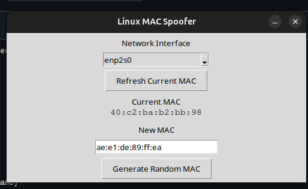

# macspoofer-linux-gui
A simple Python GUI tool for Linux that lists network interfaces and changes the active MAC address of a network adapter.
# Linux MAC Changer GUI

A graphical MAC Address Changer for Linux built with Python and Tkinter.

This tool allows users to:

- View available network interfaces
- Display the current MAC address
- Generate random locally-administered MAC addresses
- Apply custom MAC addresses
- Refresh interface information
- Manage MAC addresses through a simple graphical interface

---

## Features

✅ GUI Interface

✅ Linux Support

✅ Random MAC Generation

✅ Custom MAC Assignment

✅ Current MAC Detection

✅ Interface Selection

✅ Lightweight & Fast

✅ Built with Python and Tkinter

---

## Screenshot

Add your screenshot here:



---

## Requirements

- Linux
- Python 3.8+
- Tkinter
- iproute2 (`ip` command)
- Root privileges

---

## Installation

Clone the repository:

```bash
git clone https://github.com/YOUR_USERNAME/linux-mac-changer-gui.git
cd linux-mac-changer-gui
```

Make executable:

```bash
chmod +x macspoofer_gui.py
```

Run:

```bash
python3 macspoofer_gui.py
```

---

## Usage

### Launch Application

```bash
python3 macspoofer_gui.py
```

### Select Interface

Choose an available network interface from the dropdown menu.

Example:

```text
wlo1
enp2s0
```

### View Current MAC

Click:

```text
Refresh Current MAC
```

### Generate Random MAC

Click:

```text
Generate Random MAC
```

A new locally-administered MAC address will be generated automatically.

### Apply MAC

Click:

```text
Apply MAC Address
```

The application will:

1. Bring the interface down
2. Apply the selected MAC
3. Bring the interface back up
4. Refresh displayed information

---

## Example

Current MAC:

```text
4c:23:38:75:a5:57
```

Generated MAC:

```text
02:5d:ab:19:cc:77
```

After applying:

```text
02:5d:ab:19:cc:77
```

---

## Verify Changes

Terminal:

```bash
cat /sys/class/net/wlo1/address
```

or

```bash
ip link show wlo1
```

---

## Project Structure

```text
linux-mac-changer-gui/
│
├── macspoofer_gui.py
├── README.md
├── LICENSE
├── screenshots/
│   └── main.png
└── assets/
```

---

## Disclaimer

This project is intended for educational and system administration purposes.

Always ensure you have authorization to modify network settings on any device or network.

---

## License

MIT License
